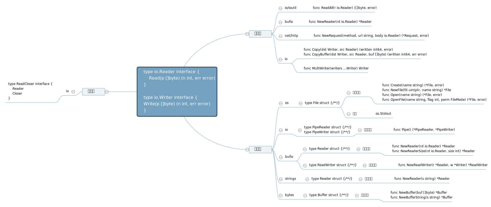

# Go语言简明Cookbook

## 目录
* [string & bytes](bytestrings)
    - [bytes.Buffer](bytestrings/buffer.go) -> 处理流数据时，用bytes.Buffer而不要用[]bytes 
    - [ioutil.ReadAll](bytestrings/buffer.go) -> 读取io.Reader内容的一个快捷方式
    - conversion
    - regex
    - format
* date and time
    - time.Sleep 一定时间后再执行后面的程序
    - time.After 要求某段程序至少要执行一定时间
    - time.Since 计算时间差， time.Now().Sub(t)的快捷方式
    - (t time.time).Sub 计算时间差
    - time.Now 计算当前时间
* type conversion
    - string & bytes
    - standard lib: strconv
    - number
* core I/O interfaces
    - [io.Reader & io.Writer](./go-briefer-cookbook.md#the-very-important-interfaces-in-go-ioreader--iowriter)
    - io.Closer
* file & file system
    - directories & files
    - working with CSV
    - working with JSON
    - working with temporary files
    - working with text template & HTML templates
* context in Go
* concurrency in Go
* databases & storage
    - db/sql
    - mySQL
    - postgreSQL
    - SQLite
    - Redis
    - MongoDB
* http client programing
* http server programing
* gRPC
* socket & web-socket
* micro-services for applications
* distributed
* testing
    * testing
    * benchmark
* data streams
* reflex

## the very important interfaces in Go: io.Reader & io.Writer
> ### 最重要的I/O接口

